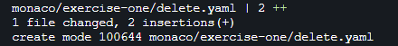
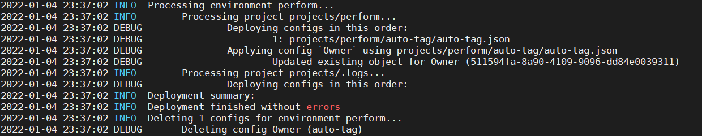

## Delete

### Delete Configuration
Configuration which is not needed anymore can also be deleted in automated fashion. This tool is looking for delete.yaml file located in projects root folder and deletes all configurations defined in this file after finishing deployment. In delete.yaml you have to specify then `name` (not id) of configuration to be deleted.

Here is one example of delete.yaml with multiple configurations:
```yaml
delete:
  - "auto-tag/app-one"
  - "auto-tag/app-two"
  - "management-zone/app-one"    
  - "calculated-metrics-service/simplenode.staging" 
```
Warning: if the same name is used for the new config and config defined in delete.yaml, then config will be deleted right after deployment.

During this exercise, we will run monaco command line to delete selected configuraiton (auto tag from exercise-one)

### Prerequisites

You have successfully completed exercise-one


### Step One - create a delete.yaml file


1. create new delete.yaml file from gitea repo under perform/monaco/exercise-one/projects
    
2. add the following to delete.yaml file
    ```yaml
    delete:
      - "auto-tag/Owner"
    ```
3. Commit your changes

### Step Two - Verify the target object ("owner" tagging rule) exist
1. Open the Dynatrace UI and navigate to settings
2. Open tags -> automatically applied tags
3. verify tagging rule "owner" exist

    

### Step Three - Pull delete.yaml file and execute Monaco command

1. Open the Dynatrace University Terminal
2. cd into the exercise-one directory
    ```bash
    $ cd /home/dtu_training/perform/monaco/exercise-one
    ```
3. Gain Root access
    ```bash
    $ sudo su
    ```
4. Execute the following command to pull down our changes from the remote repository. 
    ```bash
    $ git pull
    ```
    Make sure delete.yaml is pulled into the current directory (for example:)

    

5. Run Monaco commandline

    ```bash
    $ monaco -v -e projects/environments.yaml projects/
    ```
    Monaco should execute and you should not see any errors

    

6. Check your Dynatrace environment make sure `Owner` tagging rule is deleted.


### ***Congratulations on completing Exercise-six!***


